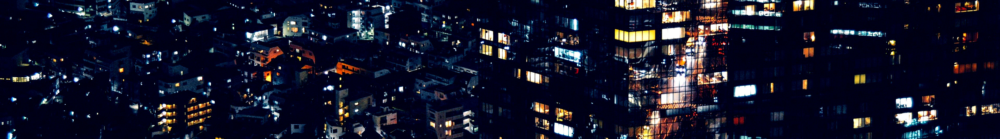

# dotfiles

Configuration files for various programs on my Linux machines

------------------------------------------------------------------------------



## What can I find in this here repository?

Configuration files for various programs, custom bash scripts that I use for
various purposes, and colorschemes for those with various aesthetic needs.

If you want to install all the files, follow the instructions in the README for
the [install directory](install/).

If you want to see all the documented dependencies/suggested installs, run the
following command from within the base directory of this dotfiles repo:

```
$ grep -r "\- " ./**/*.md | grep -Ev "Emerge|Repos|Other|#|\`" | cut -d '-' -f 2- | sed 's/ //' | sort | uniq
```

Some of those will be atoms for Gentoo packages that can be installed using
portage (emerge), others will be third party repositories that you can download
or clone and then build from source. There may also be some that simply bring
you to a webpage with further instructions to follow, or some that should be
installed with a language-specific package manager, like python's 'pip'.
